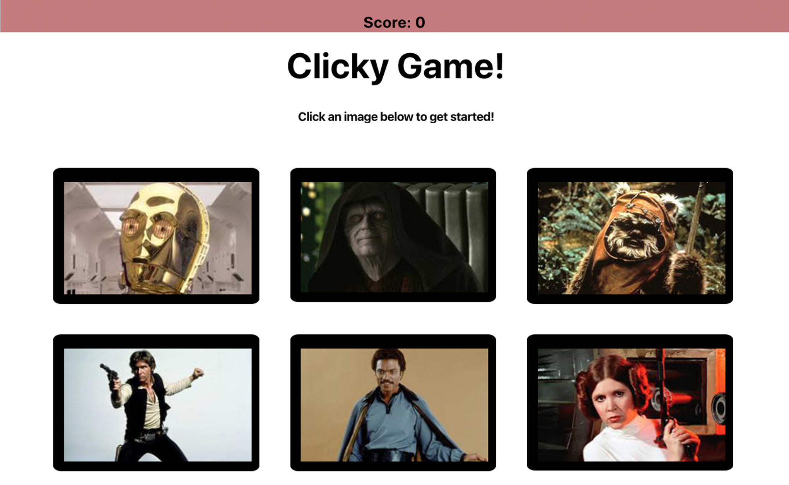

# article-scraper

<h2> <a href="https://ogilvie1231.github.io/clicky/">An exercise in React</a></h2>
&nbsp;
<!--  -->

Click an image to earn a point. Your target score is 12 but if you click
        the same image twice, you lose! Click an image below to get started and
        remeber, don't click the same image twice!

<h3>This project was built with:</h3>
<ul>
    <li>JavaScript</li>
    <li>CSS</li>
    <li>HTML</li>
    <li>React</li>
</ul>
